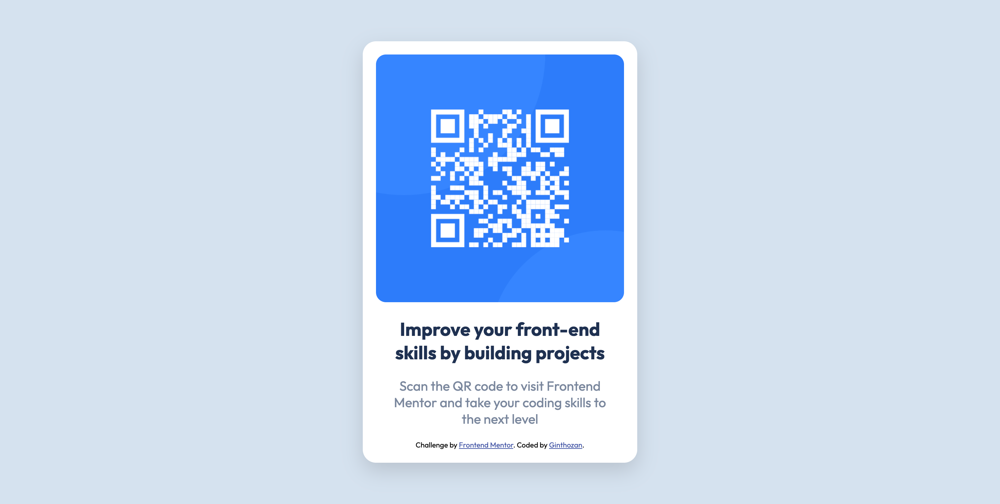

# Frontend Mentor - QR code component solution

This is a solution to the [QR code component challenge on Frontend Mentor](https://www.frontendmentor.io/challenges/qr-code-component-iux_sIO_H). Frontend Mentor challenges help you improve your coding skills by building realistic projects.

## Table of contents

- [Overview](#overview)
  - [Screenshot](#screenshot)
  - [Links](#links)
  - [Built with](#built-with)
- [Author](#author)

## Overview

### Screenshot

### Links

- Solution URL: [Add solution URL here](https://github.com/ginthozan-v/FEM-qr-code-component)

### Built with

- Semantic HTML5 markup
- CSS custom properties
- CSS Grid
- Mobile-first workflow
- No framewors just a HTML page

## Author

- LinkedIn - [Ginthozan](https://www.frontendmentor.io/profile/ginthozan-v)
- Frontend Mentor - [@ginthozan-v](https://www.frontendmentor.io/profile/ginthozan-v)
- Github - [@ginthozan-v](https://github.com/ginthozan-v)
